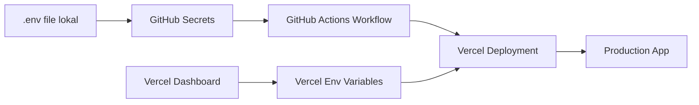

# Cara GitHub Workflow Mengambil Environment Variables

## 🔄 **Alur Pengambilan Environment Variables**

### 1. **GitHub Repository Secrets** → **GitHub Actions Workflow**

GitHub workflow mengambil env vars dari **GitHub Secrets** yang harus Anda set di repository:

```yaml
# Di file .github/workflows/deploy-frontend.yml
- name: Create test environment file
  run: |
    echo "NEXTAUTH_SECRET=${{ secrets.NEXTAUTH_SECRET }}" >> .env.test.local
    echo "GOOGLE_CLIENT_ID=${{ secrets.GOOGLE_CLIENT_ID }}" >> .env.test.local
    echo "GOOGLE_CLIENT_SECRET=${{ secrets.GOOGLE_CLIENT_SECRET }}" >> .env.test.local
    echo "DATABASE_URL=${{ secrets.DATABASE_URL }}" >> .env.test.local
```

### 2. **GitHub Secrets** → **Vercel Environment Variables**

Vercel CLI otomatis mengambil env vars dari project settings di Vercel:

```yaml
# Workflow akan menjalankan:
vercel pull --yes --environment=production --token=${{ secrets.VERCEL_TOKEN }}
vercel build --prod --token=${{ secrets.VERCEL_TOKEN }}
vercel deploy --prebuilt --prod --token=${{ secrets.VERCEL_TOKEN }}
```

## 🔧 **Cara Mengatur GitHub Secrets**

### Opsi 1: Manual (via GitHub Web)
1. Buka repository di GitHub
2. Klik **Settings** → **Secrets and variables** → **Actions**
3. Klik **New repository secret**
4. Tambahkan satu per satu:

```
VERCEL_TOKEN = [Your Vercel Token]
VERCEL_PROJECT_ID = [Your Vercel Project ID]
NEXTAUTH_SECRET = [Your NextAuth Secret]
GOOGLE_CLIENT_ID = [Your Google OAuth Client ID]
GOOGLE_CLIENT_SECRET = [Your Google OAuth Client Secret]
DATABASE_URL = [Your Database Connection String]
```

### Opsi 2: Otomatis (via GitHub CLI)
Jalankan script yang sudah disediakan:

```bash
# Install GitHub CLI dulu (jika belum)
brew install gh

# Login ke GitHub
gh auth login

# Jalankan script setup
./setup-github-secrets.sh
```

## 📊 **Alur Lengkap Environment Variables**



### 1. **Development (Local)**
```bash
# File: evently-frontend/.env
NEXT_PUBLIC_API_URL=https://evently-backend-amber.vercel.app
NEXTAUTH_SECRET=[Your NextAuth Secret]
GOOGLE_CLIENT_ID=[Your Google OAuth Client ID]
# etc...
```

### 2. **CI/CD (GitHub Actions)**
```yaml
# GitHub Actions mengambil dari secrets:
${{ secrets.NEXTAUTH_SECRET }}
${{ secrets.GOOGLE_CLIENT_ID }}
${{ secrets.GOOGLE_CLIENT_SECRET }}
${{ secrets.DATABASE_URL }}
```

### 3. **Production (Vercel)**
```yaml
# Vercel mengambil dari project settings dan workflow:
- vercel pull  # Mengambil env vars dari Vercel project
- vercel build # Build dengan env vars
- vercel deploy # Deploy dengan env vars
```

## 🔍 **Verifikasi Setup**

### Cek GitHub Secrets
```bash
gh secret list
```

### Cek Vercel Environment Variables
```bash
cd evently-frontend
vercel env ls
```

### Test Build Lokal
```bash
cd evently-frontend
pnpm run build
```

## 🚨 **Troubleshooting**

### Problem: "secret not found"
**Solusi:** Pastikan semua secrets sudah diset di GitHub repository

### Problem: "vercel token invalid"
**Solusi:** Generate token baru di https://vercel.com/account/tokens

### Problem: "build failed in CI"
**Solusi:** Cek logs di GitHub Actions untuk error detail

### Problem: "env var undefined in production"
**Solusi:** Pastikan env vars juga diset di Vercel dashboard

## 📋 **Checklist Setup**

- [ ] GitHub CLI installed dan login
- [ ] Semua secrets diset di GitHub repository
- [ ] Vercel project sudah linked
- [ ] Environment variables diset di Vercel dashboard
- [ ] `.env` file ada di lokal untuk development
- [ ] Build berhasil secara lokal
- [ ] GitHub Actions workflow sudah ada
- [ ] Repository sudah di push ke GitHub

## 🎯 **Quick Commands**

```bash
# Setup GitHub secrets otomatis
./setup-github-secrets.sh

# Verify lokal setup
./evently-frontend/verify-setup.sh

# Check GitHub secrets
gh secret list

# Check Vercel env vars
cd evently-frontend && vercel env ls

# Test build
cd evently-frontend && pnpm run build
```

Dengan setup ini, GitHub workflow akan otomatis mengambil environment variables yang diperlukan untuk build dan deployment! 🚀
